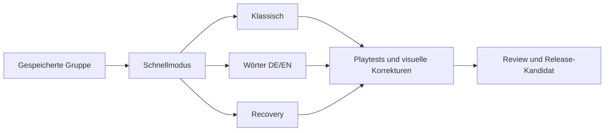

# Umsetzung: Android v1

Ziel und Arbeitsweise: [Engineering-Ablauf](autonomous-workflow.md). Kanonische [Spec](https://github.com/giarrel/word-deduction/issues/2), [lokale Lesekopie](../specs/android-release-v1.md), [Gesamtziel](https://github.com/giarrel/word-deduction/issues/1).

## Vor Implementierungsbeginn abgeschlossen

- Engineering-Skills einschließlich `implement-spec` und `codebase-design` gelesen; autonome Entscheidungen und zwei Test-Seams festgehalten.
- Erste Recherche plus [29 zusätzliche Originalrezensionen](../research/2026-10-06-expanded-player-feedback.md) aus sechs weiteren Apps ausgewertet. Die Stichprobe bleibt qualitativ und überwiegend historisch.
- [Release-/Playtest-Strategie](../research/2026-10-06-release-and-playtest-strategy.md) mit aktuellen offiziellen Quellen und lokaler Werkzeugprüfung erstellt.
- Regeln, Glossar, Spec und sieben abhängige Umsetzungstickets veröffentlicht. Keine offenen Grundregelfragen auf Implementierer abgewälzt.

## Aufgabengraph

| Ticket | Ergebnis | Voraussetzung | Stand |
|---|---|---|---|
| [Gespeicherte Gruppe](https://github.com/giarrel/word-deduction/issues/3) | Ausführbare Unity-App, dauerhafte Gruppe, Test-/Buildbasis | Keine | Abgenommen und integriert: `318af96`, Testpfad/Doku `ac0dcca` |
| [Schnellmodus](https://github.com/giarrel/word-deduction/issues/4) | Karte → Gespräch → Vote → Ergebnis → Folgepartie | Gruppe | Abgenommen und integriert: `496d446`, Integrationsprüfung `013087f` |
| [Klassischer Modus](https://github.com/giarrel/word-deduction/issues/5) | Mehrere Runden und Mr. White | Schnellmodus | Bereit zur parallelen Umsetzung |
| [Großer DE/EN-Wortbestand](https://github.com/giarrel/word-deduction/issues/6) | Redaktionelle Inhalte, Wiederholungsvermeidung, Übersetzungen | Schnellmodus | Bereit zur parallelen Umsetzung |
| [Unterbrechung und Recovery](https://github.com/giarrel/word-deduction/issues/7) | Speicherschäden, Lebenszyklus, Geheimnisschutz | Schnellmodus | Bereit zur parallelen Umsetzung |
| [Bedienung und visuelle Playtests](https://github.com/giarrel/word-deduction/issues/8) | Belegte Verbesserung der vollständigen App | Klassisch, Inhalte, Recovery | Wartet |
| [Release-Kandidat](https://github.com/giarrel/word-deduction/issues/9) | Review, APK/AAB, Verpackungsnachweise, Storeunterlagen | Playtests | Wartet |

## Prüfzugang und verbleibende externe Voraussetzungen

Unity, Android-Compiler und Paketprüfwerkzeuge sind vorhanden. Der eigene Android-16-Emulator `emulator-5580` läuft mit API 36, 1080×2400 bei 420 dpi, Google-APIs-x86_64-Image Revision 7 und ARM64-Übersetzung. Die ARM64-Gruppenbasis wurde erfolgreich gebaut, installiert und bedient. Der anfängliche Schriftfehler wurde per A/B-Vergleich auf den Emulator-Grafikpfad eingegrenzt: vorhandene NVIDIA-Hostgrafik rendert beide geprüften APKs korrekt, SwiftShader nicht. Siehe [wiederverwendbare Prüfumgebung](android-test-device.md).

Die frühere Ableitung aus `HypervisorPlatform InstallState: 2` war zu stark: Der direkte Emulatorcheck bestätigt nutzbares WHPX, und der tatsächliche Boot gelang. Keine Windows-Funktion wurde geändert und kein Rechnerneustart veranlasst. Ebenso ist die Unity-Dokumentation zum eingeschränkten Magic-Leap-x86_64-Ziel kein Beweis einer allgemeinen technischen x86_64-Buildsperre; die [6.3-Release-Notes](https://unity.com/releases/editor/whats-new/6000.3.0f1) und lokal vorhandenen Playerdateien stützen einen späteren Vergleichsbuild, falls erforderlich.

Die Gruppenbasis ist inzwischen abgenommen: 13/13 Session-Tests, 5/5 Unity-PlayMode-Tests und tatsächliche Android-Bedienung mit erhaltenen IDs, Einstellungen und Undo nach APK-Updates und Prozessneustarts. Android-spezifische Fehler bei Tastaturüberdeckung, ungewolltem Speichern durch Zurück, Tastaturabschluss und Sichtbarkeit neuer/bearbeiteter Zeilen wurden reproduziert und korrigiert. [Foundation-Nachweise](../validation/group-foundation.md), [Android-Korrekturschleifen](../validation/android-group-runtime/report.md) und [separate Integration](../validation/group-foundation-merge.md). Die Spielfunktion folgt mit Ticket 4.

Ein physisches Telefon wurde über die Chat-Rückfrage angefragt; noch keines ist bestätigt. Emulator-, übersetzte ARM64- und physische ARM64-Nachweise bleiben getrennt. Produktionssignierung, Play-Kontostatus und Publisherkontakt sind nicht geprüft; sie werden am konkreten Release-Artefakt geklärt. TalkBack und Google TTS sind im Emulator installiert, ihre Bedienbarkeit in der App ist noch nicht nachgewiesen. Eine kleine Android-Ansicht mit 360×640 dp hält Namensfeld und Plus oberhalb der Tastatur; einige skalierte Schaltflächen unterschreiten dort noch das 48-dp-Ziel und werden in Ticket 8 angepasst.

## Integrationskonvention

Die Implementation läuft auf `integration/android-v1`. Je Ticket eine eigene Branch und ein eigener Worktree; ein Merger-Agent übernimmt Integration. GitHub-Tickets werden nach tatsächlicher Abnahme mit Ergebnisnachweis geschlossen. Feste Basis des abschließenden Reviews: Planungscommit `ab25c325e02040d30755ae448c07789357730f38`.

## Schnellmodus abgenommen

21/21 Session-Tests, 10/10 Unity-PlayMode-Tests und drei vollständig bediente Android-Partien (richtiger Verdacht, falscher Verdacht, wiederholter Gleichstand). V1-Gruppe unverändert übernommen, V2 bei bewusster Aktion geschrieben; nach Folgepartien und bestätigtem Abbruch sind alle acht Spieleridentitäten erhalten. Native Zwei-Finger-Eingabe und Android-Aufnahmeschutz geprüft. [Android-Nachweise](../validation/android-quick-runtime/report.md), [separate Integration](../validation/quick-mode-merge.md). Die nächste Arbeitsfront umfasst Tickets 5, 6 und 7.
