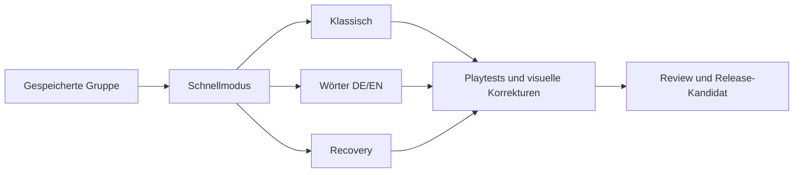

# Umsetzung: Android v1

Ziel und Arbeitsweise: [Engineering-Ablauf](autonomous-workflow.md). Kanonische [Spec](https://github.com/giarrel/word-deduction/issues/2), [lokale Lesekopie](../specs/android-release-v1.md), [Gesamtziel](https://github.com/giarrel/word-deduction/issues/1).

## Vor Implementierungsbeginn abgeschlossen

- Engineering-Skills einschließlich `implement-spec` und `codebase-design` gelesen; autonome Entscheidungen und zwei Test-Seams festgehalten.
- Erste Recherche plus [29 zusätzliche Originalrezensionen](../research/2026-10-06-expanded-player-feedback.md) aus sechs weiteren Apps ausgewertet. Die Stichprobe bleibt qualitativ und überwiegend historisch.
- [Release-/Playtest-Strategie](../research/2026-10-06-release-and-playtest-strategy.md) mit aktuellen offiziellen Quellen und lokaler Werkzeugprüfung erstellt.
- Regeln, Glossar, Spec und sieben abhängige Umsetzungstickets veröffentlicht. Keine offenen Grundregelfragen auf Implementierer abgewälzt.

## Aufgabengraph

| Ticket | Ergebnis | Voraussetzung | Stand |
|---|---|---|---|
| [Gespeicherte Gruppe](https://github.com/giarrel/word-deduction/issues/3) | Ausführbare Unity-App, dauerhafte Gruppe, Test-/Buildbasis | Keine | In Umsetzung: `ticket/3-group-foundation` |
| [Schnellmodus](https://github.com/giarrel/word-deduction/issues/4) | Karte → Gespräch → Vote → Ergebnis → Folgepartie | Gruppe | Wartet |
| [Klassischer Modus](https://github.com/giarrel/word-deduction/issues/5) | Mehrere Runden und Mr. White | Schnellmodus | Wartet |
| [Großer DE/EN-Wortbestand](https://github.com/giarrel/word-deduction/issues/6) | Redaktionelle Inhalte, Wiederholungsvermeidung, Übersetzungen | Schnellmodus | Wartet |
| [Unterbrechung und Recovery](https://github.com/giarrel/word-deduction/issues/7) | Speicherschäden, Lebenszyklus, Geheimnisschutz | Schnellmodus | Wartet |
| [Bedienung und visuelle Playtests](https://github.com/giarrel/word-deduction/issues/8) | Belegte Verbesserung der vollständigen App | Klassisch, Inhalte, Recovery | Wartet |
| [Release-Kandidat](https://github.com/giarrel/word-deduction/issues/9) | Review, APK/AAB, Verpackungsnachweise, Storeunterlagen | Playtests | Wartet |

## Prüfzugang und verbleibende externe Voraussetzungen

Unity, Android-Compiler und Paketprüfwerkzeuge sind vorhanden. Kein Android-Gerät ist von ADB erkannt, kein Emulator in den geprüften Standardpfaden. Die zusätzliche lokale Prüfung meldet vorhandenen Hypervisor, aber `HypervisorPlatform` mit `InstallState: 2` (deaktiviert); die CPU-WMI-Flags unter einem aktiven Hypervisor sind kein hinreichender Gegenbeweis für Hardwareunterstützung. Etwa 180 GB sind frei. Ein beschleunigter Emulator ist somit noch nicht nachgewiesen. Außerdem begrenzt [Unity 6.3 den X86_64-Android-Zielpfad auf bestehende Projekte](https://docs.unity3d.com/6000.3/Documentation/ScriptReference/AndroidArchitecture.X86_64.html). Ein Emulatoraufbau ist vorerst kein Ersatz für einen verifizierten ARM64-Gerätetest; Windows-Funktionen oder Neustarts wurden nicht veranlasst.

Das verhindert keine weitere Entwicklung, erlaubt aber noch keinen behaupteten Gerätetest. Produktionssignierung, Play-Kontostatus und Publisherkontakt sind nicht geprüft; sie werden am konkreten Release-Artefakt geklärt. Die erste App-Strecke wird gerade implementiert; noch kein erfolgreicher Word-Deduction-Build.

## Integrationskonvention

Die Implementation läuft auf `integration/android-v1`. Je Ticket eine eigene Branch und ein eigener Worktree; ein Merger-Agent übernimmt Integration. GitHub-Tickets werden nach tatsächlicher Abnahme mit Ergebnisnachweis geschlossen. Feste Basis des abschließenden Reviews: Planungscommit `ab25c325e02040d30755ae448c07789357730f38`.
