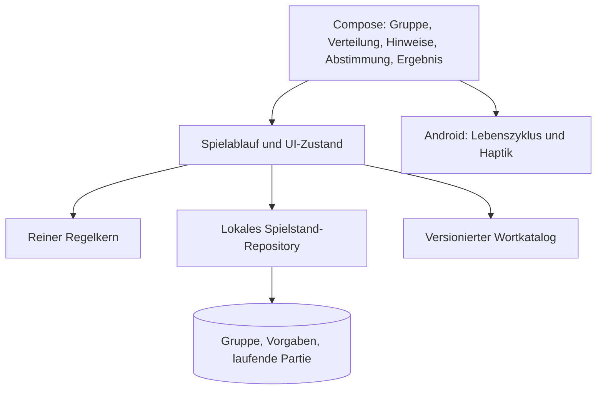

# Android-first: Architektur-Recherche für word-deduction

Nachtrag vom 6. Oktober 2026: Der Nutzer hat inzwischen **Unity** gewählt. Maßgeblich sind die [aktuellen Projektentscheidungen](../project-direction.md) und der [erweiterte Setup-Check](../development/unity-setup.md). Letzterer bestätigt eine zweite, vollständige Android-Installation von Unity 6000.3.25f1; die unten stehende erste Installationsprüfung war auf 6000.6.3f1 beschränkt. Die ursprüngliche Technikwertung bleibt als Recherchehistorie erhalten.

Stand und Zugriff auf alle Webquellen: **6. Oktober 2026**. Status: begründeter Vorschlag, **keine beschlossene Architektur und keine Implementierung**. Die Produkt- und Community-Recherche wird separat dokumentiert.

## Empfehlung

**Für den derzeit beschriebenen Umfang empfehle ich Kotlin mit Jetpack Compose.** Die anspruchsvollen Teile sind Gruppenverwaltung, eine zuverlässige Wiederaufnahme, verdeckte Informationen und klare Abläufe. Dafür ist eine Android-App mit eigenständig testbarem Regelkern eine passende Ausgangsbasis. Android empfiehlt Compose, eine getrennte UI- und Datenschicht sowie einen gerichteten Datenfluss; diese Empfehlungen lassen sich auch mit wenigen Paketen in einer kleinen App umsetzen. [Android-Architekturempfehlungen][a1]

**Flutter ist die bevorzugte Alternative, wenn iOS schon für die erste Produktphase verbindlich wird.** Es unterstützt gemeinsame UI und Logik über Android und iOS. Unity bleibt technisch möglich, ist für das bisherige, überwiegend aus Text, Listen und Karten bestehende Spiel aus meiner Sicht jedoch mehr Infrastruktur als nötig. Unity sollte gewinnen, wenn konkrete Unity-Erfahrung oder eine nachgewiesene gestalterische Anforderung seinen zusätzlichen Aufbau rechtfertigt. Alle drei Optionen können ansprechende Oberflächen erzeugen; „hübscher“ ist kein Alleinstellungsmerkmal einer Engine. [Flutter-Architektur][f1], [Compose-Animationen][a2], [Flutter-Animationen][f2], [Unity-UI-Vergleich][u1]

Diese Wertung ist eine Schlussfolgerung aus dem Produktumfang und den dokumentierten Fähigkeiten, kein Benchmark. Es wurden keine APK-Größen, Startzeiten, Akkulaufzeiten oder Entwicklungsgeschwindigkeiten gemessen.

## Anforderungen, Annahmen und offene Punkte

Vom Nutzer bestätigt:

- Android zuerst; Unity ist bereits installiert.
- Zwischen Partien Personen schnell hinzufügen, entfernen, umbenennen oder für spätere Partien wieder aufnehmen. Gruppe und Einstellungen sollen erhalten bleiben.
- Schlichte, gut bedienbare Oberfläche. Bei der Wortverteilung steht zunächst der Spielername auf einer Karte; durch Hochziehen wird das geheime Wort sichtbar.
- Eine kurze Variante mit einer Hinweisschleife und Abstimmung sowie eine längere Variante mit mehreren Runden sind interessant.
- Ein brauchbarer Wortbestand genügt zunächst; ein Shop oder komplexes Wortpaketsystem hat keine Priorität.

**Arbeitsannahmen:** Eine Gruppe spielt gemeinsam vor Ort mit einem herumgereichten Android-Gerät; Spiel und Wortbestand funktionieren vollständig offline. Ein Gerät ist plausibel, aber noch nicht ausdrücklich bestätigt. Bei getrennten Geräten entstünden zusätzliche Fragen zu Verbindungen, Zuständigkeit für den Spielstand, Geheimnisverteilung und Wiederverbindung. Das würde diese Architekturentscheidung verändern.

Noch zu entscheiden: genaue Rollenbesetzung je Modus, Zahl und Umgang mit Stimmen, Gleichstand, erlaubte Rücknavigation, Siegbedingungen, Ausstieg während einer laufenden Partie sowie die Bedeutung von iOS im ersten Release. Die technische Grundlage soll diese Entscheidungen ermöglichen, aber nicht vorwegnehmen.

## Vergleich der drei Optionen

Die Bewertung der Eignung ist unsere Ableitung; die Links belegen die technischen Möglichkeiten.

| Thema | Kotlin / Jetpack Compose | Flutter | Unity |
|---|---|---|---|
| Listen, Namen, Gruppenverwaltung | Direkter Android-Ansatz; gute Passung für den Schwerpunkt der App. Compose ist Googles empfohlener moderner UI-Weg. [A1][a1] | UI und Spielablauf in Dart, gemeinsame Darstellung über Plattformen. [F1][f1] | Mit uGUI oder UI Toolkit möglich. Engine-spezifische UI-Werkzeuge und Projektstruktur kommen hinzu. [U1][u1] |
| Karte hochziehen, Übergänge, Gestaltung | Animierbare Werte, Übergänge und Sichtbarkeit sind vorhandene Bausteine. Eigene Gestaltung möglich. [A2][a2] | Eigene Animationen und Widget-Übergänge sind Kernfunktionen. [F2][f2] | UI-Animationen möglich; uGUI integriert sich mit Animation Clips/Timeline, UI Toolkit bietet eigene Übergänge. [U1][u1] |
| Haptik | Direkter Zugang zu Android-Haptik. Systemkonforme Ereignisse statt beliebiger Dauervibrationen. [A3][a3] | `HapticFeedback` kapselt Standardverhalten der Plattform; keine präzise Motorsteuerung. [F3][f3] | `Handheld.Vibrate` bietet einfache Vibration. Für fein abgestimmte Android-Haptik wäre eine native Anbindung gesondert zu prüfen. [U2][u2], [A3][a3] |
| Persistenz und Neustart | DataStore oder Room; UI-Zustand zusätzlich über Saved State. Plattformmechanismen passen direkt zusammen. [A4][a4], [A5][a5], [A6][a6] | Lokale Speicherung etwa mit SQLite; Restoration für kleinen UI-Zustand. Die App muss beides bewusst verwenden. [F4][f4], [F5][f5] | Dauerhafte Dateien möglich; Speichern und Wiederherstellen müssen selbst modelliert werden. `OnApplicationQuit` ist mobil keine verlässliche letzte Speichermöglichkeit. [U3][u3], [U4][u4] |
| Wartung | Android-Buildkette und Android-Bibliotheken; Android-spezifische UI. | Flutter/Dart plus Android-Buildkette und ausgewählte Plugins; für iOS zusätzlich dessen Projekt und Tests. [F1][f1], [F6][f6], [F7][f7] | Unity-Version, Pakete, Android-Modul und passende Toolchain; UI und Spielkern dürfen nicht an Szenenlebenszeiten hängen. [U5][u5] |
| APK für Testgruppen | Signierte APK über Android-Werkzeuge. [A7][a7] | APK und App Bundle werden offiziell unterstützt. [F6][f6] | APK und App Bundle werden offiziell unterstützt. [U6][u6] |
| Später iOS | Für den hier vorgeschlagenen Android-Ansatz zusätzliche UI-/Plattformarbeit einplanen. Ein isolierter Regelkern reduziert die fachliche Kopplung, garantiert aber keine kostenlose Portierung. | Gemeinsame Codebasis ist ein wesentliches Argument. Lokales iOS-Bauen benötigt trotzdem macOS/Xcode. [F1][f1], [F7][f7] | Plattformübergreifende Spielimplementierung möglich; Unity erzeugt für iOS ein Xcode-Projekt. Der lokale finale Build benötigt macOS/Xcode. [U7][u7] |
| Offline | Für alle drei vollständig möglich, wenn Regeln, Wörter und Spielstand lokal liegen und der Spielstart von keinem Server abhängt. Das ist eine Produkt-/Architekturentscheidung, kein automatisches Framework-Merkmal. | Gleiche Anforderung. | Gleiche Anforderung. |

Für eine Android-only-Testphase ist Compose mein Vorschlag. Bei einem verbindlichen zeitnahen iOS-Ziel würde ich die Priorität auf Flutter verschieben. Für Unity gibt es derzeit keinen bestätigten Bedarf an 3D, Physik oder einer komplexen Szenenwelt.

## Lokale Unity-Prüfung

Nur folgende übliche Installationspfade wurden lesend geprüft; weder Unity noch ein Projekt wurden gestartet:

- `C:\Program Files\Unity\Hub\Editor\6000.6.3f1\Editor\Unity.exe` existiert. Dateimetadaten melden `ProductVersion=6000.6.3f1_45d8eee7de74`.
- `Editor\Data\PlaybackEngines\AndroidPlayer` sowie dessen Unterpfade `SDK`, `NDK` und `OpenJDK` sind in dieser Installation nicht vorhanden.

Damit ist die Editor-Installation bestätigt, **die Android-Baufähigkeit aber nicht**. Unity verlangt Android Build Support, SDK, NDK und JDK. Andere Installationsorte oder individuell konfigurierte Tools wurden nicht untersucht; ein tatsächlicher Build wurde nicht versucht. [Unity Android-Setup][u5]

Falls später Unity gewählt wird, wäre zuerst die passende Android-Unterstützung zu prüfen und danach eine signierte Test-APK zu bauen. Die vorhandene Installation allein sollte die Framework-Wahl nicht entscheiden.

## Kleine modulare Offline-Architektur

Die folgenden Bausteine sind ein Entwurf aus unseren Anforderungen. Zunächst genügt ein Android-App-Modul mit klar getrennten Paketen und expliziten Abhängigkeiten. Ein zusätzlicher reiner Kotlin-Baustein für Regeln ist sinnvoll, sobald die Trennung den Tests hilft. Server, Benutzerkonten und ein allgemeines Plugin-System sind für die Arbeitsannahme nicht erforderlich.



| Baustein | Verantwortung | Entscheidende Grenze |
|---|---|---|
| Gruppe | Personen mit stabiler ID, Namen, Aktivstatus und Reihenfolge verwalten | Die Gruppe besteht über viele Partien hinweg. |
| Regelkern | Gültige Besetzungen, Phasenwechsel, Abstimmung, Eliminierung und Ergebnis bestimmen | Keine UI-, Android-, Datei- oder Unity-Abhängigkeit. |
| Ablauf / Darstellung | Eingaben entgegennehmen, Speicheroperationen koordinieren, passende öffentliche oder private Ansicht bereitstellen | Ein Bildschirm entscheidet nicht selbst über einen Sieg. |
| Repository | Den vollständigen bestätigten Zustand laden und atomar aktualisieren | Eine erfolgreiche Aktion bedeutet auch einen erfolgreich gespeicherten Zustand. |
| Wortkatalog | Lokale Wörter laden, prüfen und auswählen | Regeln kennen Begriffe und Paar-IDs, aber keine Dateipfade oder Shops. |

Dieses Aufteilen folgt der dokumentierten Trennung von UI, Datenzugang und Zustandsfluss; die konkreten Grenzen sind unser projektspezifischer Vorschlag. Manuelle Übergabe der wenigen Abhängigkeiten genügt anfangs. [Android-Architekturempfehlungen][a1]

### Gruppe und Partie unbedingt trennen

Vorgeschlagenes Modell:

- `Player`: stabile `playerId`, bearbeitbarer Anzeigename, `activeForNextMatch`, Reihenfolge.
- `Group`: ihre Personen; zunächst kann eine gespeicherte Gruppe genügen.
- `MatchSetup`: Modus, gewünschte Rollenanzahlen, Wortauswahl und weitere bestätigte Regeln.
- `MatchSnapshot`: eigene `matchId`, unveränderlicher Teilnehmer-Snapshot aus IDs und Namen, eingefrorene Regeln, zugeteilte Wörter/Rollen und Reihenfolge.
- `MatchProgress`: aktuelle Phase, Verteilungsfortschritt, lebende Teilnehmer, Abstimmungsstand, Rundenindex und gegebenenfalls Ergebnis.

Beispiel: Lea pausiert eine Partie, Noah kommt hinzu, „Chris“ wird in „Chris B.“ umbenannt. Danach startet die nächste Partie aus den aktiven Gruppenmitgliedern. Die Einstellungen bleiben bestehen. Eine bereits laufende Partie behält ihre Teilnehmer und Namen; Gruppenänderungen dürfen ihre Rollenzuordnung nicht verschieben.

„Pausieren“ soll ein schneller Schalter sein. „Entfernen“ entfernt die Person aus der Gruppe; eine bereits gespeicherte Partie bleibt durch ihren Snapshot lesbar. Teilnehmer werden niemals über ihre Listenposition oder ihren Namen identifiziert. Gleiche Namen sind technisch zulässig, sollten für die Spielrunde aber unterscheidbar gemacht werden.

Eine beendete oder bewusst abgebrochene Partie führt zurück zur bestehenden Gruppe und zum letzten gültigen Setup. Eine zu kleine aktive Gruppe macht eine unpassende Rollenanzahl sichtbar und korrigierbar, statt still Einstellungen zu verändern. Änderungen während einer Partie sollten zunächst ausdrücklich für die nächste Partie gelten; ein echter Einstieg mitten ins Spiel benötigt eigene Spielregeln.

### Modi und Rollen als getrennte Entscheidungen

Die Anzahl der Hinweis-/Abstimmungszyklen ist eine andere Frage als die Rollenbesetzung. Zwei Abläufe vorbereiten:

1. **Kurzpartie:** Wörter verteilen → eine Hinweisschleife → Abstimmung → Ergebnis nach ausdrücklich definierten Kurzregeln.
2. **Eliminationspartie:** Wörter verteilen → Hinweise → Abstimmung → Eliminierung / Sonderaktion → Sieg prüfen → gegebenenfalls nächste Hinweisschleife.

Die Kurzpartie darf nicht bloß die Eliminationspartie nach einer Runde abbrechen: Sie benötigt eine vollständige Ergebnisregel. Ebenso bleiben Gleichstände, geheime versus offene Abstimmung und Siegschwellen explizite Regeln. Ein Versionsfeld im gespeicherten Regelset verhindert, dass ein App-Update eine laufende Partie unbemerkt nach anderen Regeln fortsetzt.

Für die Undercover-Referenz besonders relevant: Normale Spieler und Undercover sehen am Anfang ihr Wort und kennen ihre konkrete Rolle nicht; Mr. White erhält kein Wort. Die UI darf deshalb nicht allein deshalb „Undercover“ anzeigen, weil der interne Zustand diese Information enthält. Die Herstellerregeln beschreiben außerdem einen Rateversuch für einen eliminierten Mr. White. Unsere Varianten können davon abweichen, müssen das aber bewusst festlegen. [Offizielle Undercover-Regeln][g1]

Die Darstellung erhält daher je Phase eine eingeschränkte Sicht: etwa Name + verdeckte Karte, Name + eigenes Wort oder eine Mr.-White-Anweisung. Nicht jeder Bildschirm bekommt den kompletten internen Zustand einschließlich aller Geheimnisse.

## Dauerhafte Speicherung und Android-Wiederaufnahme

**Zentrale Akzeptanzbedingung:** Nach einem bestätigten Hinzufügen, Umbenennen, Pausieren, Partiestart, Übergabeschritt oder Abstimmungsschritt muss ein Neustart die passende Gruppe und Partie wiederherstellen. Eine sichtbare Karte wird dabei immer wieder verdeckt.

`ViewModel` übersteht Konfigurationswechsel, aber keinen vom System beendeten Prozess. `SavedStateHandle` und `rememberSaveable` eignen sich für kleinen UI-Zustand; der vollständige fachliche Spielstand gehört in dauerhaften lokalen Speicher. Diese Unterscheidung ist genau für das vom Nutzer beschriebene „alles neu einstellen“ entscheidend. [Compose State Saving][a6]

**Speichervorschlag für den kleinen Startumfang:** Ein typisierter DataStore mit einem versionierten `AppState`, der Gruppe, Setup-Vorgaben und eine laufende Partie enthält. Die fachlichen Modelle bleiben getrennt, liegen aber gemeinsam in einem atomar aktualisierten kleinen Dokument. DataStore unterstützt typisierte Serialisierung einschließlich JSON und transaktionale Aktualisierung. Bei wachsender Historie, vielen Gruppen, gezielten Teilabfragen oder benötigter referenzieller Integrität ist Room geeigneter. [DataStore][a4], [Room][a5]

Konkrete Regeln für die Umsetzung:

- Jede fachliche Aktion seriell verarbeiten: Zustand laden/prüfen → neuen Zustand berechnen → dauerhaft speichern → bestätigten UI-Zustand veröffentlichen. Ein Versionszähler oder explizit geprüfte Phase verhindert doppelte Verarbeitung schneller Eingaben.
- Den ersten vollständigen Partiestand einschließlich gezogener Wörter und Rollen speichern, **bevor** jemand seine Karte sehen kann. Bei Wiederaufnahme wird nie neu ausgelost.
- Nach erfolgreichem „Verdecken und weitergeben“ den nächsten Übergabeplatz speichern. Bei einem Abbruch davor erscheint derselbe Spieler wieder mit verdeckter Karte. Niemand wird still übersprungen.
- Schreibfehler lassen den zuletzt bestätigten Zustand bestehen. Ein erneuter Versuch muss dieselbe Aktion sicher ausführen können; fehlgeschlagenes Speichern darf keine scheinbar fertige Abstimmung erzeugen.
- `schemaVersion`, getestete Migrationen und Datenvalidierung einplanen. Ein beschädigter Spielstand darf nicht still durch eine leere Gruppe überschrieben werden; Fehler sichtbar machen und vorhandene Daten für einen Wiederherstellungsversuch erhalten.
- Animationsfortschritt, offene Tastatur und „Wort gerade sichtbar“ sind flüchtige Darstellung. Personen, Besetzung, Phase und bestätigte Stimmen sind dauerhaft.
- Lebenszyklus-Ereignisse dienen zusätzlich zum Verdecken und Aufräumen. Sie ersetzen das Speichern nach Aktionen nicht.

Für Flutter gilt dieselbe Trennung: Restoration-Daten klein halten und echte Daten aus der lokalen Quelle zurückladen. Unity warnt selbst davor, auf mobilen Plattformen ausschließlich in `OnApplicationQuit` zu speichern. Der fachliche Entwurf bleibt also unabhängig von der Framework-Wahl notwendig. [Flutter RestorationManager][f5], [Unity OnApplicationQuit][u4]

## Verdeckte Karte und Übergabe

Bestätigt ist der Ablauf **Name sichtbar → Karte hochziehen → eigenes Wort sichtbar**. Folgende Details sind Empfehlungen für den späteren Prototyp:

1. Die Karte beginnt geschlossen und zeigt eindeutig die Person, die das Gerät erhalten soll.
2. Ein bewusstes Hochziehen gibt nur deren erlaubte Information frei. Eine barrierearm bedienbare Alternative zur Geste muss denselben Ablauf ermöglichen.
3. Vor der nächsten Person wird die Karte vollständig geschlossen. Die fortsetzende Aktion ist erst dann verfügbar; die nächste Person muss erneut aufdecken.
4. Hintergrundwechsel, Sperrbildschirm, Zurücknavigation und Wiederaufnahme schließen die Karte. Ein im Spielstand gespeichertes „schon gesehen“ öffnet sie nicht automatisch.
5. Verdeckte Wörter sind auch aus der Accessibility-Beschreibung entfernt; bloß eine optisch darübergelegte Fläche genügt nicht. Keine automatische Sprachausgabe geheimer Wörter im gemeinsamen Raum; zugängliche private Bedienung muss im Prototyp mitgedacht werden.
6. Für geheime Ansichten Androids `FLAG_SECURE` prüfen, das Bildschirmaufnahmen und Darstellung auf nicht sicheren Displays unterbindet. Das ergänzt die Übergabelogik, ersetzt sie aber nicht. [Android FLAG_SECURE][a8]

Die UI sollte Geheimnisse nicht in Logs oder allgemeinen Fehlermeldungen ausgeben. Bei einem Partyspiel geht es hier vor allem darum, versehentliches Verraten beim Weiterreichen oder Wiederöffnen zu vermeiden.

## Zufall und Wortquelle

Rollenvergabe als einmalige Initialisierung hinter einer kleinen `RandomSource`-Schnittstelle. Für Android ist `SecureRandom` eine verfügbare Systemquelle; der Regelkern erhält daraus Zufallswerte, ohne selbst die Plattform zu kennen. In Tests wird dieselbe Schnittstelle kontrolliert befüllt. Eine korrekt gemischte Teilnehmerliste wird anhand der festgelegten Rollenanzahlen belegt. Die Zuteilung wird gespeichert und bei Wiederaufnahme unverändert gelesen. [Android SecureRandom][a9]

Fairnessbedingungen: Jede aktive Person wird genau einmal aufgenommen; die konfigurierte Rollenanzahl wird exakt eingehalten; die aktuelle Listenposition macht niemanden häufiger zur Sonderrolle. Ein absichtlicher Ausgleich über mehrere Partien wäre eine zusätzliche Produktregel, nicht eine still eingeführte Eigenschaft des Zufalls.

Vorschlag für den anfänglichen, mitgelieferten JSON-Wortbestand:

```json
{
  "schemaVersion": 1,
  "packId": "starter-de",
  "contentVersion": 1,
  "locale": "de",
  "pairs": [
    {
      "id": "fruit-apple-pear",
      "majorityWord": "Apfel",
      "undercoverWord": "Birne",
      "tags": ["alltag", "essen"]
    }
  ]
}
```

Das ist ein Formatbeispiel, kein fertig kuratierter Wortbestand. Für Varianten ohne abweichendes Wort kann nur das Mehrheitswort verwendet werden. Eine spätere flexible Quelle erhält dieselbe interne Schnittstelle; Dateiauswahl oder Importoberfläche werden dafür jetzt noch nicht benötigt.

Beim Einlesen eindeutige IDs, bekannte Schema-Version, vorhandene Wörter und nicht leere Auswahl prüfen. Inhalte redaktionell auf Mehrdeutigkeit, Nähe der Wortpaare und Zielgruppe prüfen. Eine kleine gespeicherte Liste zuletzt gespielter Paar-IDs kann unmittelbare Wiederholungen vermeiden; bei erschöpfter Auswahl kontrolliert neu beginnen. Eine laufende Partie speichert ihre tatsächlichen Wörter zusätzlich zur Paar-/Paketversion, damit Inhaltsupdates ihre Geheimnisse nicht ändern.

## Gezielte Tests und spätere Experimente

Jetzt wurde nur recherchiert. Folgende Experimente reduzieren vor einer endgültigen Architekturentscheidung die wesentlichen Risiken:

| Experiment | Prüfung | Erfolgskriterium |
|---|---|---|
| Gruppenwechsel auf einem echten Gerät | Gruppe einrichten; Person pausieren, andere hinzufügen, Namen ändern; nächste Partie starten | Kein erneutes Komplett-Setup; aktive Teilnehmer stimmen; vorige Partie bleibt konsistent. Bedienprobleme beobachten. |
| Kartengeste | Name → hochziehen → verdecken → übergeben, auch einhändig und mit großem Text | Kein Wort blitzt bei Personenwechsel auf; die Geste wird ohne Erklärung verstanden; zugängliche Alternative funktioniert. |
| Lebenszyklus | Während Verteilung, Abstimmung und Gruppenbearbeitung: Rotation, Home, Sperren, System-Prozessende und erneuter Start | Bestätigte Änderungen vorhanden; Geheimnisse geschlossen; weder Neuauslosung noch übersprungene Person. Activity-Neuerstellung und echtes Prozessende separat prüfen. |
| Speicherausfall | Fehler beim Schreiben, doppelte Eingabe, Abbruch an einer Speichergrenze, ältere Schema-Version | Entweder alter oder vollständig neuer Zustand; keine halbe Partie; kein stiller Gruppenverlust. |
| Beide Modi auf Papier | Kurze Partie und Eliminationspartie inklusive Gleichstand, Mr.-White-Rateversuch, Ausstieg | Für jede zulässige Phase eine klare Fortsetzung oder ein Ergebnis, ohne dass Screens spontane Regeln erfinden. |
| Android-Auslieferung | Signierte APK installieren und über eine ältere Testversion aktualisieren; Flugmodus | Start und ganze Partie funktionieren offline; Update bewahrt Gruppe und laufenden Zustand. |

Regeltests sollen beobachtbares Verhalten prüfen: Teilnehmer-Snapshot bleibt nach Umbenennen stabil; unzulässige Rollenbesetzung wird abgewiesen; Rollen- und Wortverteilung passen; ausgeschiedene Personen können nicht erneut eliminiert werden; Gleichstands- und Siegentscheidungen entsprechen dem gewählten Regelset. Dazu wenige UI-Tests für Übergabe, Geheimnisverdeckung und Gruppenwechsel sowie Speicher-/Migrationstests. Für Zufall bevorzugt deterministische Invarianten statt instabiler statistischer Grenztests.

Falls Unity nach dieser Recherche weiterhin favorisiert wird, denselben kleinen Ablauf dort prototypisieren und auf demselben Gerät prüfen. Erst tatsächliche Unterschiede bei Bedienung, Aufwand oder gemessener Auslieferung rechtfertigen dann eine abweichende Wahl; keine erfundenen „Unity ist immer langsam“- oder „native ist immer schöner“-Annahmen.

## Quellen und Grenzen

Alle unten verlinkten technischen Quellen sind Herstellerdokumentation und wurden am **6. Oktober 2026** geöffnet. Unity-Aussagen zu Setup, Build und UI wurden für **6000.6** geprüft, passend zur lokal gefundenen Editor-Version. API- und SDK-Versionen sollten bei einer späteren Implementierung erneut festgelegt werden. Ein erfolgreicher Android-/iOS-Build wurde in dieser Runde nicht nachgewiesen.

- Android: [Architektur][a1], [Compose-Animationen][a2], [Haptik][a3], [DataStore][a4], [Room][a5], [Compose State Saving][a6], [Signierung][a7], [FLAG_SECURE][a8], [SecureRandom][a9].
- Flutter: [Architektur][f1], [Animationen][f2], [HapticFeedback][f3], [SQLite][f4], [RestorationManager][f5], [Android-Auslieferung][f6], [iOS-Auslieferung][f7].
- Unity 6.6: [UI-Systeme][u1], [Vibration][u2], [Persistentes Datenverzeichnis][u3], [Beenden der App][u4], [Android-Setup][u5], [Android-Build][u6], [iOS-Build][u7].
- Spielreferenz: [Offizielle Undercover-Regeln von Yanstar Studio][g1]. Dies belegt die Referenzregeln, keine endgültigen Regeln unseres Spiels.

[a1]: https://developer.android.com/topic/architecture/recommendations
[a2]: https://developer.android.com/develop/ui/compose/animation/introduction
[a3]: https://developer.android.com/develop/ui/views/haptics/haptic-feedback
[a4]: https://developer.android.com/topic/libraries/architecture/datastore
[a5]: https://developer.android.com/training/data-storage/room
[a6]: https://developer.android.com/develop/ui/compose/state-saving
[a7]: https://developer.android.com/studio/publish/app-signing
[a8]: https://developer.android.com/reference/android/view/WindowManager.LayoutParams#FLAG_SECURE
[a9]: https://developer.android.com/reference/java/security/SecureRandom
[f1]: https://docs.flutter.dev/resources/architectural-overview
[f2]: https://docs.flutter.dev/ui/animations
[f3]: https://api.flutter.dev/flutter/services/HapticFeedback-class.html
[f4]: https://docs.flutter.dev/cookbook/persistence/sqlite
[f5]: https://api.flutter.dev/flutter/services/RestorationManager-class.html
[f6]: https://docs.flutter.dev/deployment/android
[f7]: https://docs.flutter.dev/deployment/ios
[u1]: https://docs.unity3d.com/6000.6/Documentation/Manual/UI-system-compare.html
[u2]: https://docs.unity3d.com/6000.6/Documentation/ScriptReference/Handheld.Vibrate.html
[u3]: https://docs.unity3d.com/6000.6/Documentation/ScriptReference/Application-persistentDataPath.html
[u4]: https://docs.unity3d.com/6000.6/Documentation/ScriptReference/MonoBehaviour.OnApplicationQuit.html
[u5]: https://docs.unity3d.com/6000.6/Documentation/Manual/android-sdksetup.html
[u6]: https://docs.unity3d.com/6000.6/Documentation/Manual/android-BuildProcess.html
[u7]: https://docs.unity3d.com/6000.6/Documentation/Manual/iphone-BuildProcess.html
[g1]: https://www.yanstarstudio.com/undercover-how-to-play
