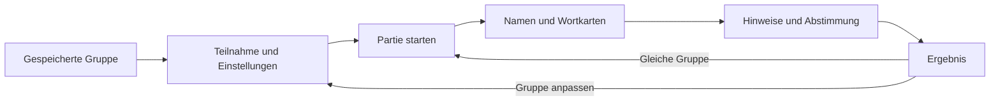

# Word Deduction: Produktvorschlag nach der ersten Recherche

Nachtrag vom 6. Oktober 2026: **Unity ist inzwischen gewählt; die Karte soll beim Loslassen wieder zuklappen.** Siehe [aktuelle Projektentscheidungen](../project-direction.md) und [Unity-Setup](../development/unity-setup.md). Die nachfolgende erste Synthese dokumentiert den vorherigen Entscheidungsstand.

Stand: 6. Oktober 2026. Diese Notiz verbindet die beiden getrennten Recherchen zu [Community-Feedback](2026-10-06-community-feedback.md) und [Android-Architektur](2026-10-06-android-architecture.md). Sie ist eine Empfehlung für den ersten Prototyp, keine bereits verabschiedete Spezifikation.

## Ausgangspunkt und Empfehlung

Das Produkt sollte einen Spieleabend mit wechselnden Personen möglichst reibungslos begleiten. Die zentrale Qualität ist: Nach einer Partie kann die Gruppe sofort weiterspielen oder einzelne Personen ändern, ohne ihre übrige Konfiguration neu aufzubauen.

Empfohlene Richtung: Android zuerst, lokale Speicherung, ein herumgereichtes Gerät, eine kleine Oberfläche und zwei verständliche Spielvoreinstellungen. Als technische Basis empfiehlt die separate Recherche Kotlin mit Jetpack Compose. Falls iOS zeitnah gleichrangig wird, ist Flutter vor der Umsetzung erneut abzuwägen. Die vorhandene Unity-Installation allein entscheidet die Technikwahl nicht.

## Was der Nutzer bereits festgelegt hat

Quelle dieser Anforderungen: Projektgespräch vom 6. Oktober 2026, einschließlich der Rückfrage zur Aufdeckgeste.

| Priorität | Bestätigter Wunsch |
| --- | --- |
| Sehr hoch | Zwischen Partien Personen leicht hinzufügen, entfernen oder umbenennen; wechselnde Teilnahme ermöglichen. |
| Sehr hoch | Gruppe und Einstellungen erhalten; kein unerwarteter Rauswurf oder vollständiger Neueinrichtungszwang. |
| Hoch | Schnörkelloser, leicht verständlicher Ablauf. |
| Hoch | Zunächst den Spielernamen sehen, dann die Karte hochziehen, um das geheime Wort aufzudecken. |
| Zu untersuchen | Ein kurzer Modus mit einem Durchgang und Entscheidung sowie ein klassischer Modus mit mehreren Durchgängen; Varianten mit und ohne Mr. White. |
| Niedriger | Umfangreiche Wortpaket-Verwaltung; zunächst genügt ein sinnvoller Grundbestand aus einer einfachen Datenquelle. |
| Plattform | Android zuerst; Unity ist bereits installiert, die Technikwahl ist offen. |

Arbeitsannahmen, noch nicht ausdrücklich bestätigt: gemeinsames Gerät statt Netzwerkspiel; zunächst deutsche Wörter; Nutzung ohne Anmeldung und ohne Internet; keine Monetarisierung im ersten Prototyp. Diese Annahmen begrenzen die folgende Empfehlung.

## Was die Community-Recherche tatsächlich hergibt

Die separate Recherche wertet 18 ausgewählte Spielerbeiträge zu vier Apps aus, davon neun Android-Rezensionen, sieben iOS-Rezensionen und zwei Reddit-Kommentare. Das ist eine qualitative Stichprobe; sie erlaubt keine Aussagen über Mehrheiten oder Marktanteile.

| Beobachtung | Bedeutung für unseren Vorschlag |
| --- | --- |
| Leichte Bedienung und gemeinsames Spielen werden gelobt; bei Vucaks App auch Werbefreiheit und Einmalkauf. | Den Kernablauf schnell zugänglich halten. [Originalrezensionen](https://play.google.com/store/apps/details?id=at.vucak.impostor) |
| Wiederkehrende Wörter und ein als klein empfundener Gratisvorrat stören einzelne Gruppen. | Früh Wortqualität und Wiederholungsvermeidung testen. [Undercover-Rezensionen](https://apps.apple.com/us/app/undercover-word-party-game/id946882449?see-all=reviews), [Imposter-Rezensionen](https://apps.apple.com/us/app/imposter-game-party-edition/id6745120053?platform=iphone&see-all=reviews) |
| In Secret Spy wurde am 23. März 2026 berichtet, dass eliminierte Personen nicht in die nächste Online-Partie kommen; der Anbieter meldete am 27. März einen Fix. | Wiedereinstieg und Partiewechsel als eigenes Akzeptanzszenario behandeln. Das belegt einen historischen Online-Fehler, keinen aktuellen lokalen Fehler. [Originalrezension und Antwort](https://play.google.com/store/apps/details?id=com.DefaultCompany.Impostor) |
| Eine Rezension zu Annalysts App kritisiert Werbung bereits beim Öffnen der Einstellungen. | Den ersten Prototyp ohne solche Unterbrechungen testen. [Originalrezension](https://play.google.com/store/apps/details?hl=en_US&id=com.bluffcircle.party) |

Für exakt unsere lokale Gruppenbearbeitung, die Hochziehgeste und eine Präferenz zwischen den beiden Rundenmodi fehlt ein belastbarer externer Mehrheitsbeleg. Diese Punkte bleiben Nutzerprioritäten beziehungsweise Hypothesen für den eigenen Spieltest.

## Die Gruppenverwaltung als Kernfunktion

Die folgenden Details sind eigene Produktvorschläge, abgeleitet aus den bestätigten Problemen:

- **Eine Gruppe behalten:** Namen, Teilnahmestatus und zuletzt verwendete Einstellungen bleiben nach einer Partie und einem App-Neustart erhalten.
- **Teilnahme umschalten:** Eine Person kann die nächste Partie aussetzen und später zurückkehren. Aussetzen und dauerhaftes Entfernen sind getrennte Aktionen.
- **Namen direkt bearbeiten:** Umbenennen verändert die Anzeige, nicht die Identität eines Spielers. Zwei gleiche Namen dürfen intern niemals dieselbe Person werden; die Oberfläche muss sie unterscheidbar machen.
- **Neue Person hinzufügen:** Name eingeben und in derselben Gruppenansicht bleiben. Die bisherigen Namen und Einstellungen bleiben erhalten.
- **Entfernen korrigieren können:** Eine versehentliche Entfernung zwischen Partien soll rückgängig gemacht werden können. Eine konkrete Undo-Geste ist noch zu entwerfen.
- **Nächste Partie direkt starten:** Auf dem Ergebnisbildschirm gibt es einen klaren Weg zur nächsten Partie mit derselben aktiven Gruppe und einen Weg zu „Gruppe anpassen“.
- **Ausgeschieden bedeutet nur diese Partie:** Eliminierte Personen sind in der nächsten Partie automatisch wieder dabei, sofern sie nicht ausdrücklich pausieren.
- **Regeln nach Gruppenänderung prüfen:** Wenn eine kleinere Gruppe nicht mehr zur Rollenverteilung passt, braucht es eine verständliche Korrektur vor dem Start; keine stillschweigende ungültige Partie.

Technisch benötigt jede Person eine stabile ID. Beim Start wird aus den aktiven Personen eine feste Teilnehmerliste für diese Partie erzeugt. Änderungen für die nächste Partie verändern diesen laufenden Stand nicht. Was beim tatsächlichen Weggehen einer Person mitten in einer Partie passieren soll, bleibt eine eigene Regelentscheidung; ein sofortiger unbemerkter Reset ist kein sinnvoller Standard.

Der interne Schleifenablauf von E unterscheidet sich nach Spielmodus. Die äußere Gruppe bleibt erhalten.

## Zwei Spielmodi, klar benannte Regeln

In dieser Recherche bezeichnet **Partie** das Spiel von der Wortvergabe bis zum Ergebnis. Eine **Hinweisrunde** bedeutet, dass jede noch beteiligte Person einen Hinweis gibt. Im klassischen Modus kann eine Partie mehrere Hinweisrunden mit anschließender Abstimmung enthalten. Damit werden „neue Runde“ und „neue Partie“ nicht versehentlich vermischt.

Die offizielle Undercover-Anleitung beschreibt Wortvergabe, Beschreibung, Diskussion und wiederholte Eliminierung. Mehrheit und Undercover wissen anfangs nicht, welcher dieser beiden Rollen ihr Wort entspricht; Mr. White erhält kein Wort und bekommt nach seiner Eliminierung einen Rateversuch. Das ist eine konkrete Referenzvariante, kein Beweis dafür, welche beiden Apps der Nutzer gespielt hat. [Offizielle Anleitung](https://www.yanstarstudio.com/undercover-how-to-play)

| Vorschlag | Ablauf | Nutzen für dieses Projekt | Zu prüfen |
| --- | --- | --- | --- |
| Schnell | Eine Hinweisrunde, Diskussion, eine Abstimmung, Ergebnis. Ausgangsvorschlag: genau ein Undercover mit anderem Wort, ohne Mr. White. | Niemand sitzt mehrere Eliminationsrunden draußen; häufiger Gelegenheit zum Ein- und Aussteigen. | Bei wenig Information kann die Entscheidung zufällig wirken. Eine große Gruppe braucht trotzdem Zeit für jeden Hinweis. |
| Klassisch | Hinweise, Diskussion und Eliminierung wiederholen, bis die definierte Siegbedingung erreicht ist. Mr. White als wählbare Ergänzung. | Mehr Informationen und Möglichkeiten zum Bluffen innerhalb derselben Partie. | Frühe Eliminierung führt zu Zuschauerzeit; Dauer und Siegbedingungen müssen zur Gruppe passen. |

Diese Zuordnung ist eine Designhypothese, gestützt durch die Erfahrung des Nutzers. Die Recherche liefert keinen repräsentativen Nachweis, dass einer der Modi allgemein bevorzugt wird. Spiellänge und Rollenbesetzung sollten intern getrennte Regeln sein; für den Einstieg genügen zwei Voreinstellungen anstelle einer großen Optionsmatrix.

Vor der Regelspezifikation sind insbesondere festzulegen:

1. **Siegbedingungen je Modus und Rollenmix.** Nicht pauschal jede ähnliche App-Regel übernehmen. Die offizielle FAQ nennt für eine gemischte Undercover-/Mr.-White-Gruppe einen gemeinsamen Sieg bei nur einem verbleibenden Civilian. [FAQ](https://www.yanstarstudio.com/undercover-faq)
2. **Stimmengleichstand.** Ein klarer Ablauf statt zufälliger oder stiller Eliminierung. Die FAQ bietet mehrere Varianten; sie legt keinen einzigen universellen Ablauf fest. [FAQ](https://www.yanstarstudio.com/undercover-faq)
3. **Startperson bei Mr. White.** Wenn Mr. White nie beginnt, verrät die Startposition etwas über die Rolle. Wenn er beginnt, fehlen Hinweise. Spieler und Entwickler benennen diesen Zielkonflikt ausdrücklich. [Originaldiskussion](https://www.reddit.com/r/digitaltabletop/comments/8ntayr/iosandroid_undercover_a_werewolflike_social/)
4. **Abstimmungsbedienung.** Für den ersten Test bietet sich mündliches Abstimmen mit anschließender Ergebniseingabe am Gerät an. Eine geheime digitale Abstimmung erfordert einen weiteren Übergabezyklus. Die Präferenz ist noch offen.
5. **Mr.-White-Rateversuch.** Vorschlag für die lokale Gruppe: Antwort mündlich nennen, Gruppe bestätigt die Gültigkeit. So muss das erste Produkt noch keine Synonyme, Tippfehler und Beugungen automatisch bewerten.

## Wortkarten und Wörter

Die bestätigte Geste wird zum visuellen Mittelpunkt: großer Name auf einer verdeckten Karte; das Hochziehen legt das Wort frei. Dezente Bewegung und Haptik können diese Handlung unterstützen. Ob die Karte beim Loslassen sofort zurückgeht oder bewusst geschlossen wird, ist im Prototyp zu testen und noch nicht durch die Nutzerantwort festgelegt.

Vor jeder Weitergabe sowie nach App-Wechsel oder Wiederaufnahme erscheint zuerst die verdeckte Namenskarte. Die Wortanzeige darf im klassischen Wortpaar-Modus nicht nebenbei die unbekannte Undercover-Rolle verraten. Ein zusätzlicher zugänglicher Aufdeckweg kann die Ziehgeste ergänzen. Große Bedienelemente und passende Semantik sind auf Android dokumentierte Grundlagen; die offizielle Empfehlung nennt mindestens 48 dp für interaktive Touch-Flächen. [Android: Accessibility defaults](https://developer.android.com/develop/ui/compose/accessibility/api-defaults)

Die erste Inhaltsquelle kann eine versionierte JSON-Datei mit eigenen deutschen Wortpaaren sein. Das reicht für Bearbeitung im Repo und spätere Erweiterung. Ein Importdialog, ein Paket-Shop und ein Inhaltsserver sind für diese erste Prüfung entbehrlich.

Als eigenes Startziel schlage ich etwa 150 redaktionell geprüfte Paare aus Alltag, Essen, Gegenständen, Orten, Tieren und Tätigkeiten vor. Diese Zahl ist eine Planungsannahme, kein aus Rezensionen abgeleiteter Mindestwert. Bewertet werden müssen Vertrautheit, ähnliche Abstraktionsebene und genügend gemeinsame Merkmale, damit beide Wörter plausible Hinweise erlauben. Ein Verlauf zuletzt genutzter Paar-IDs reduziert Wiederholungen auch über mehrere App-Starts. Ob und wann Paarseiten vertauscht werden, gehört zur Wort- und Regelprüfung.

## Was der erste Prototyp nachweisen sollte

Die folgenden Tests sind Vorschläge für eine spätere Umsetzungsrunde; in dieser Recherche wurde noch keine App gebaut oder mit Spielern getestet.

| Szenario | Akzeptanz für den ersten Test |
| --- | --- |
| Eine Person kommt hinzu, eine pausiert, eine wird umbenannt | Übrige Namen, gewählter Modus und passende Einstellungen bleiben erhalten. |
| Eine Partie endet | Alle nicht pausierten Gruppenmitglieder stehen für die nächste Partie bereit, einschließlich zuvor eliminierter Personen. |
| Gerät sperren, App wechseln, App-Prozess beenden | Beim Neustart sind Gruppe und der letzte bestätigte Partiestand wieder vorhanden; das Wort ist verdeckt. |
| Schnell und klassisch mit derselben Gruppe spielen | Wechsel des Modus verlangt keine erneute Namenseingabe; jede Partie endet nach den gewählten Regeln. |
| Wortkarte weitergeben | Vor dem nächsten Aufdecken sind Name und Besitzerwechsel eindeutig, das vorherige Wort bleibt verborgen. |
| Mehrere Partien hintereinander | Keine unmittelbare Wiederholung, solange ungenutzte passende Paare vorhanden sind; leere Auswahl wird verständlich behandelt. |

Für einen ersten Gruppentest sollten wir die Zeit vom Ergebnis bis zur nächsten Wortvergabe, notwendige Neueingaben, versehentliche Wortenthüllungen, Wartezeit eliminierter Personen und Wortverständlichkeit beobachten. Konkrete Zeitgrenzen und eine akzeptable Gruppengröße werden erst nach diesem Test festgelegt.

## Ergebnis der Research-Runde

Empfohlen ist ein kleiner Android-Prototyp mit Schwerpunkt Gruppenwechsel, Wiederaufnahme und Wortkarte, auf dessen Basis beide Spielmodi ausprobiert werden können. Wortqualität gehört früh zum Spieltest; eine umfangreiche Verwaltung der Wortpakete kann später folgen. Die ausführlichen Belege, Einschränkungen und Technikvergleiche stehen in den beiden verlinkten Rechercheberichten.
